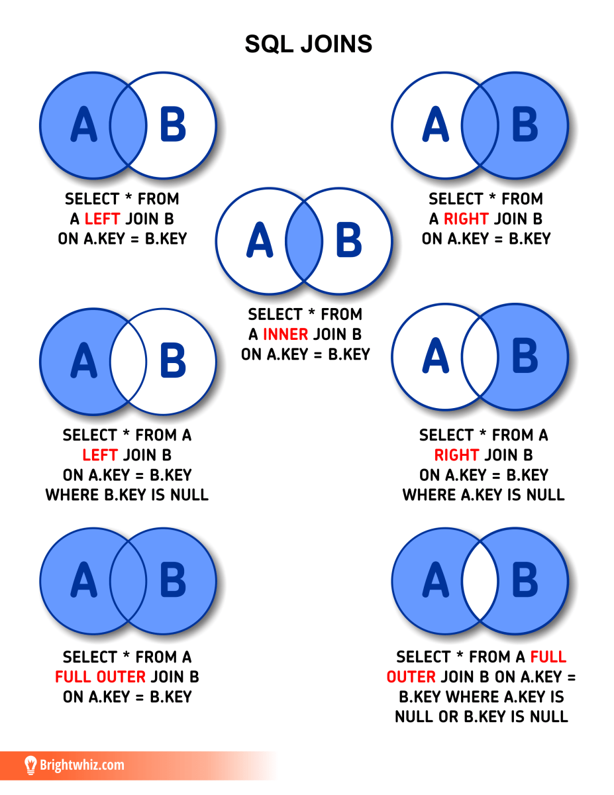
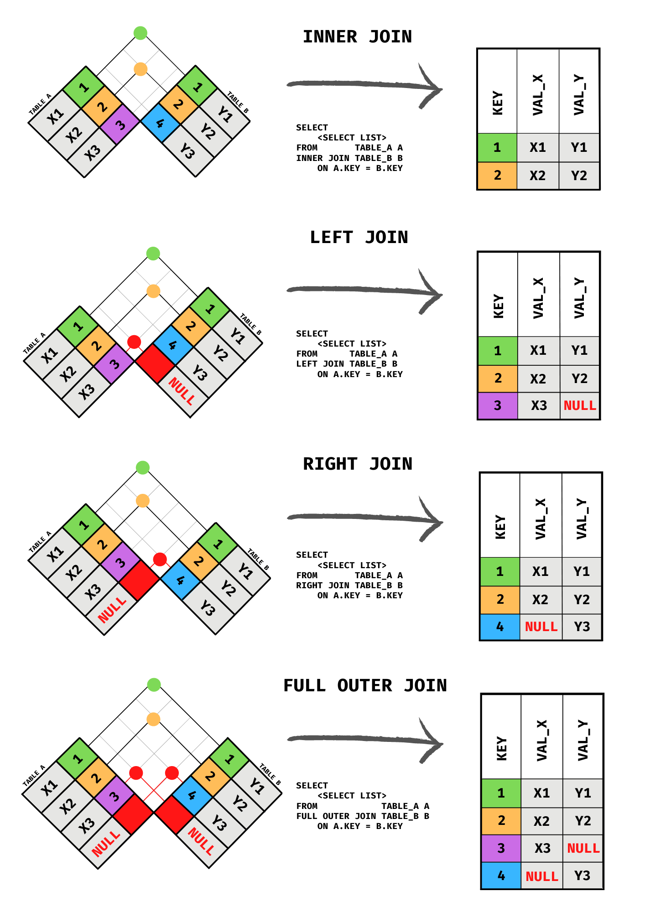
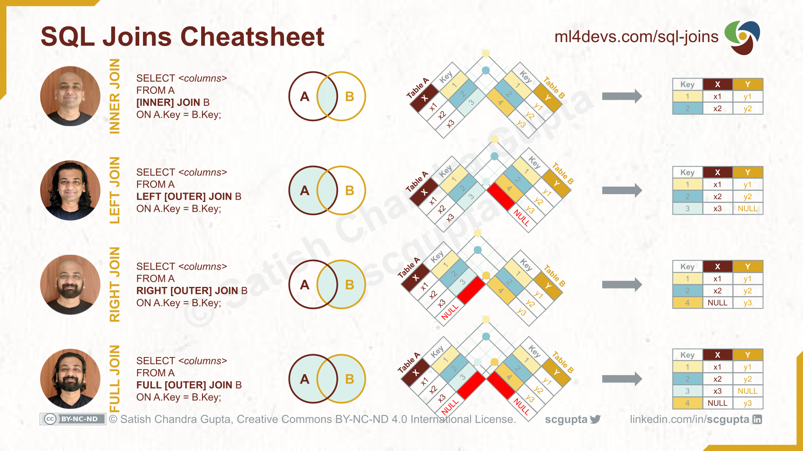

# SQLite II - Table Relationships and Joins

<br>

## 1. Table Relationships

Real-world data rarely lives in a single table. Instead, data is split across multiple related tables to avoid repetition and keep things organized. 

> ℹ️ Database normalization:
>
> Database normalization is a process used in relational databases (SQL databases) to organize data to reduce redundancy and improve data integrity.

Understanding how tables relate to each other is the foundation of relational databases.

<br><br>

### One-to-Many (e.g., customers → orders)

In a **one-to-many** relationship, one row in table A can be associated with many rows in table B, but each row in table B belongs to exactly one row in table A.

**Example:** One customer can place many orders, but each order belongs to only one customer.

```
customers          orders
----------         ----------
customer_id  <──  customer_id (FK)
name               order_id
email              amount
                   order_date
```

This is the most common type of relationship in relational databases.

<br><br>

### Primary Keys vs Foreign Keys

- A **primary key** uniquely identifies each row in a table. No two rows can share the same primary key value, and it can never be `NULL`.
- A **foreign key** is a column in one table that references the primary key of another table. It creates the link between the two tables.


| Concept      | Purpose                                      | Table         |
|--------------|----------------------------------------------|---------------|
| Primary Key  | Uniquely identifies a row                    | "Parent" table |
| Foreign Key  | Points to a primary key in another table     | "Child" table  |

<br>


```sql
-- customers.customer_id  →  PRIMARY KEY
-- orders.customer_id     →  FOREIGN KEY referencing customers
```


<br><br>

### FOREIGN KEY Constraint Syntax

To define a foreign key in SQLite, you declare it in the `CREATE TABLE` statement using the `REFERENCES` keyword. You also need to enable foreign key enforcement at runtime, because SQLite does not enforce it by default.

```sql
-- Step 1: Enable foreign key enforcement (run once per connection)
PRAGMA foreign_keys = ON;

-- Step 2: Create the parent table
CREATE TABLE customers (
    customer_id INTEGER PRIMARY KEY,
    name        TEXT    NOT NULL,
    email       TEXT    NOT NULL
);

-- Step 3: Create the child table with the FOREIGN KEY constraint
CREATE TABLE orders (
    order_id    INTEGER PRIMARY KEY,
    amount      REAL    NOT NULL,
    order_date  TEXT    NOT NULL,
    customer_id INTEGER NOT NULL,
    FOREIGN KEY (customer_id) REFERENCES customers(customer_id)
);
```

With `PRAGMA foreign_keys = ON`, SQLite will reject any `INSERT` or `UPDATE` that would create a dangling foreign key (i.e., a `customer_id` in `orders` that does not exist in `customers`).

Let's insert some sample data we'll use throughout this lesson:

```sql
INSERT INTO customers (customer_id, name, email) VALUES
    (1, 'Alice',   'alice@example.com'),
    (2, 'Bob',     'bob@example.com'),
    (3, 'Charlie', 'charlie@example.com');

INSERT INTO orders (order_id, amount, order_date, customer_id) VALUES
    (101, 49.99,  '2024-01-10', 1),
    (102, 120.00, '2024-01-15', 1),
    (103, 75.50,  '2024-02-01', 2),
    (104, 200.00, '2024-02-20', 2),
    (105, 30.00,  '2024-03-05', 2);
-- Note: Charlie (customer_id=3) has no orders yet.
```

---

<br><br>

## 3. Intro to SQL Joins 


A **JOIN** is a SQL operation that combines data from two or more tables based on a related column. Joins allow you to retrieve information that is spread across multiple tables, making it possible to work with connected data in a relational database.

The most common types of joins are:

- **INNER JOIN**: Returns only the rows that have matching values in both tables.
- **LEFT JOIN (LEFT OUTER JOIN)**: Returns all rows from the left table, along with matching rows from the right table. If there is no match, the right-side columns contain `NULL` values.
- **RIGHT JOIN (RIGHT OUTER JOIN)**: Returns all rows from the right table, along with matching rows from the left table. If there is no match, the left-side columns contain `NULL` values.
- **FULL JOIN (FULL OUTER JOIN)**: Returns all rows from both tables, including matched and unmatched rows. Where no match exists, the missing side contains `NULL` values.

Joins are one of the core features of SQL and are essential for querying relational databases efficiently.


Here are some useful cheatsheets:




<br>



<br>

<!--

-->


Or, a classic cheatsheet for SQL joins...


<br>


Also useful (detailed cheat sheet): 
- https://images.datacamp.com/image/upload/v1679944084/Joining_Data_in_SQL_458a8fa873.png


---

<br><br>

## 3. INNER JOIN

An **INNER JOIN** returns only the rows where there is a match in **both** tables. Rows that have no matching counterpart in the other table are excluded from the result.

**Syntax:**

```sql
SELECT columns
FROM   table_a
INNER JOIN table_b ON table_a.key = table_b.key;
```

**Venn diagram analogy:** Only the overlapping section — rows present in both tables.

**Example:** Retrieve all orders together with the name and email of the customer who placed them.

```sql
SELECT
    customers.name,
    customers.email,
    orders.order_id,
    orders.amount,
    orders.order_date
FROM   orders
INNER JOIN customers ON orders.customer_id = customers.customer_id;
```

**Result:**

| name  | email             | order_id | amount | order_date |
|-------|-------------------|----------|--------|------------|
| Alice | alice@example.com | 101      | 49.99  | 2024-01-10 |
| Alice | alice@example.com | 102      | 120.00 | 2024-01-15 |
| Bob   | bob@example.com   | 103      | 75.50  | 2024-02-01 |
| Bob   | bob@example.com   | 104      | 200.00 | 2024-02-20 |
| Bob   | bob@example.com   | 105      | 30.00  | 2024-03-05 |

Charlie does not appear because he has no orders. This is the defining behavior of `INNER JOIN`.

**Using table aliases** to keep queries concise:

```sql
SELECT
    c.name,
    c.email,
    o.order_id,
    o.amount
FROM   orders    AS o
INNER JOIN customers AS c ON o.customer_id = c.customer_id;
```

**Aggregating with INNER JOIN:** Total spending per customer.

```sql
SELECT
    c.name,
    COUNT(o.order_id)  AS total_orders,
    SUM(o.amount)      AS total_spent
FROM   customers AS c
INNER JOIN orders AS o ON c.customer_id = o.customer_id
GROUP BY c.customer_id;
```

| name  | total_orders | total_spent |
|-------|--------------|-------------|
| Alice | 2            | 169.99      |
| Bob   | 3            | 405.50      |

---

<br><br>

## 4. LEFT JOIN

A **LEFT JOIN** (also written `LEFT OUTER JOIN`) returns **all rows from the left table**, plus any matching rows from the right table. When there is no match in the right table, the columns from that table are filled with `NULL`.

**Syntax:**

```sql
SELECT columns
FROM   table_a                          -- left table
LEFT JOIN table_b ON table_a.key = table_b.key;
```

**Venn diagram analogy:** The entire left circle, with the overlapping section filled in from the right.

**Example:** List all customers and their orders — including customers who have never placed an order.

```sql
SELECT
    c.name,
    c.email,
    o.order_id,
    o.amount,
    o.order_date
FROM   customers AS c
LEFT JOIN orders AS o ON c.customer_id = o.customer_id;
```

**Result:**

| name    | email                | order_id | amount | order_date |
|---------|----------------------|----------|--------|------------|
| Alice   | alice@example.com    | 101      | 49.99  | 2024-01-10 |
| Alice   | alice@example.com    | 102      | 120.00 | 2024-01-15 |
| Bob     | bob@example.com      | 103      | 75.50  | 2024-02-01 |
| Bob     | bob@example.com      | 104      | 200.00 | 2024-02-20 |
| Bob     | bob@example.com      | 105      | 30.00  | 2024-03-05 |
| Charlie | charlie@example.com  | NULL     | NULL   | NULL       |

Charlie appears with `NULL` values in the order columns because he has no matching rows in `orders`.

**Common use case — finding rows with no match:** Use a `WHERE` filter on a `NULL` foreign key column to find customers who have never placed an order.

```sql
SELECT
    c.name,
    c.email
FROM   customers AS c
LEFT JOIN orders AS o ON c.customer_id = o.customer_id
WHERE  o.order_id IS NULL;
```

| name    | email               |
|---------|---------------------|
| Charlie | charlie@example.com |

**Key difference vs INNER JOIN:** `LEFT JOIN` guarantees every row from the left table appears in the result. `INNER JOIN` does not.

---

<br><br>

## 5. RIGHT JOIN


A **RIGHT JOIN** (also `RIGHT OUTER JOIN`) is the mirror image of a `LEFT JOIN`. It returns **all rows from the right table**, plus any matching rows from the left table. When there is no match in the left table, those columns are filled with `NULL`.

**Syntax:**

```sql
SELECT columns
FROM   table_a
RIGHT JOIN table_b ON table_a.key = table_b.key;
```

**Example:** Show all orders and the customer who placed each one — keeping every order even if the customer record is somehow missing.

```sql
SELECT
    c.name,
    c.email,
    o.order_id,
    o.amount
FROM   customers AS c
RIGHT JOIN orders AS o ON c.customer_id = o.customer_id;
```

In our current dataset this produces the same five rows as the `INNER JOIN`, because every order has a valid customer. The difference would appear if an order existed with a `customer_id` that had no matching row in `customers`.

**Tip:** In practice, `RIGHT JOIN` is less common because you can always rewrite it as a `LEFT JOIN` by swapping the table order:

```sql
-- These two queries return the same result:

SELECT c.name, o.order_id
FROM customers AS c
RIGHT JOIN orders AS o ON c.customer_id = o.customer_id;

-- Equivalent LEFT JOIN (swap the tables):
SELECT c.name, o.order_id
FROM orders AS o
LEFT JOIN customers AS c ON o.customer_id = c.customer_id;
```

---

<br><br>

## 6. FULL OUTER JOIN

A **FULL OUTER JOIN** combines the behavior of `LEFT JOIN` and `RIGHT JOIN`. It returns **all rows from both tables**. Where there is no match on either side, `NULL` is used to fill the missing columns.

**Syntax:**

```sql
SELECT columns
FROM   table_a
FULL OUTER JOIN table_b ON table_a.key = table_b.key;
```

**Example:** Show every customer and every order, whether or not they have a matching counterpart.

```sql
SELECT
    c.name,
    c.email,
    o.order_id,
    o.amount
FROM   customers AS c
FULL OUTER JOIN orders AS o ON c.customer_id = o.customer_id;
```

This would return:
- All customers (with `NULL` order columns if they have no orders).
- All orders (with `NULL` customer columns if the customer does not exist).

**Emulating FULL OUTER JOIN on older SQLite versions** using `UNION`:

```sql
-- LEFT JOIN side (all customers + matching orders)
SELECT c.name, c.email, o.order_id, o.amount
FROM   customers AS c
LEFT JOIN orders AS o ON c.customer_id = o.customer_id

UNION

-- RIGHT JOIN side (all orders + matching customers), unmatched orders only
SELECT c.name, c.email, o.order_id, o.amount
FROM   customers AS c
RIGHT JOIN orders AS o ON c.customer_id = o.customer_id
WHERE  c.customer_id IS NULL;
```

<br><br>

### Summary of Join Types

| Join Type        | Rows returned                                                       |
|------------------|---------------------------------------------------------------------|
| `INNER JOIN`     | Only rows with a match in **both** tables                           |
| `LEFT JOIN`      | All rows from the **left** table + matching rows from the right     |
| `RIGHT JOIN`     | All rows from the **right** table + matching rows from the left     |
| `FULL OUTER JOIN`| All rows from **both** tables                                       |

---

<br><br>
<hr><hr>
<br><br>

## (Bonus) Practice SQL Joins

Use the `customers` and `orders` tables created earlier in this lesson to answer the following questions. Write a SQL query for each one.

**Setup reminder** (run this if you're starting fresh):

```sql
PRAGMA foreign_keys = ON;

CREATE TABLE customers (
    customer_id INTEGER PRIMARY KEY,
    name        TEXT    NOT NULL,
    email       TEXT    NOT NULL
);

CREATE TABLE orders (
    order_id    INTEGER PRIMARY KEY,
    amount      REAL    NOT NULL,
    order_date  TEXT    NOT NULL,
    customer_id INTEGER NOT NULL,
    FOREIGN KEY (customer_id) REFERENCES customers(customer_id)
);

INSERT INTO customers VALUES
    (1, 'Alice',   'alice@example.com'),
    (2, 'Bob',     'bob@example.com'),
    (3, 'Charlie', 'charlie@example.com');

INSERT INTO orders VALUES
    (101, 49.99,  '2024-01-10', 1),
    (102, 120.00, '2024-01-15', 1),
    (103, 75.50,  '2024-02-01', 2),
    (104, 200.00, '2024-02-20', 2),
    (105, 30.00,  '2024-03-05', 2);
```

---

**Exercise 1 — Basic INNER JOIN**

List each order's `order_id`, `amount`, and the `name` of the customer who placed it. Order the results by `amount` descending.

<details>
<summary>Solution</summary>

```sql
SELECT
    o.order_id,
    o.amount,
    c.name
FROM   orders AS o
INNER JOIN customers AS c ON o.customer_id = c.customer_id
ORDER BY o.amount DESC;
```

</details>

---

**Exercise 2 — LEFT JOIN for missing data**

List the `name` and `email` of every customer who has **not** placed any orders.

<details>
<summary>Solution</summary>

```sql
SELECT
    c.name,
    c.email
FROM   customers AS c
LEFT JOIN orders AS o ON c.customer_id = o.customer_id
WHERE  o.order_id IS NULL;
```

</details>

---

**Exercise 3 — Aggregation with JOIN**

For each customer who has placed at least one order, show their `name`, the number of orders they have placed (`total_orders`), and their total spending (`total_spent`). Order by `total_spent` descending.

<details>
<summary>Solution</summary>

```sql
SELECT
    c.name,
    COUNT(o.order_id) AS total_orders,
    SUM(o.amount)     AS total_spent
FROM   customers AS c
INNER JOIN orders AS o ON c.customer_id = o.customer_id
GROUP BY c.customer_id, c.name
ORDER BY total_spent DESC;
```

</details>

---

**Exercise 4 — LEFT JOIN with aggregation**

Show the `name` of **every** customer (including those with no orders), alongside their `total_orders` count and `total_spent`. Customers with no orders should show `0` for both columns.

*Hint: Use `COALESCE` to replace `NULL` with `0`.*

<details>
<summary>Solution</summary>

```sql
SELECT
    c.name,
    COUNT(o.order_id)        AS total_orders,
    COALESCE(SUM(o.amount), 0) AS total_spent
FROM   customers AS c
LEFT JOIN orders AS o ON c.customer_id = o.customer_id
GROUP BY c.customer_id, c.name
ORDER BY total_spent DESC;
```

</details>

---

**Exercise 5 — FULL OUTER JOIN (SQLite 3.39+)**

Write a query using `FULL OUTER JOIN` that shows every customer and every order side by side. Rows without a match on either side should still appear with `NULL` in the unmatched columns.

<details>
<summary>Solution</summary>

```sql
SELECT
    c.customer_id,
    c.name,
    o.order_id,
    o.amount
FROM   customers AS c
FULL OUTER JOIN orders AS o ON c.customer_id = o.customer_id;
```

</details>


